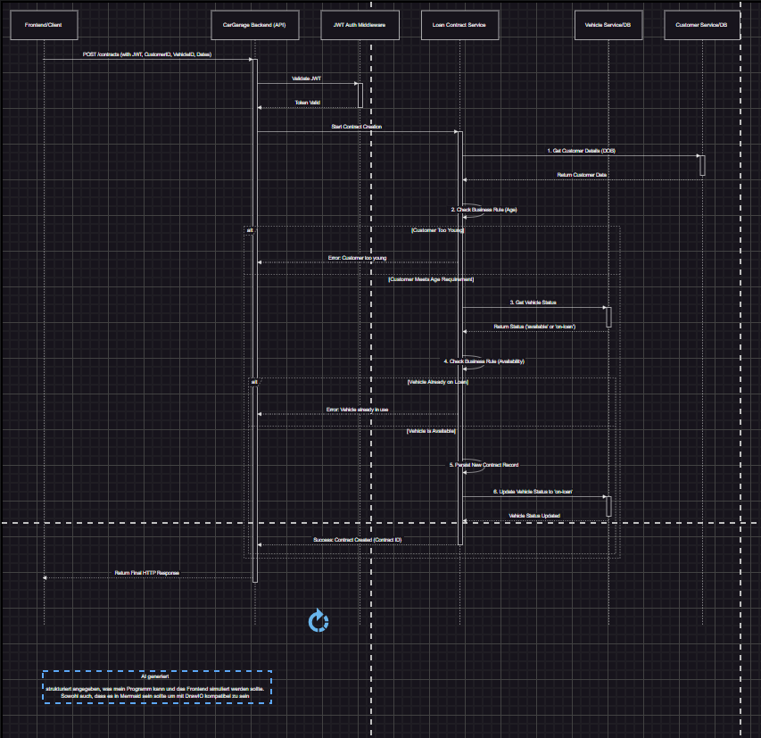
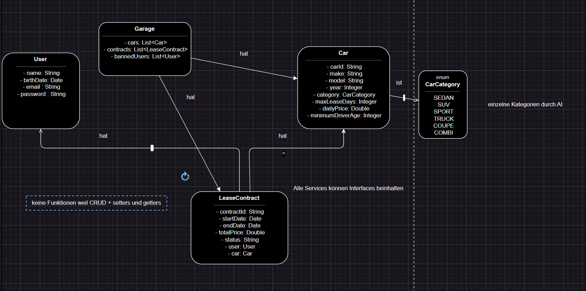

Backend for a car garage

must

class car and garage to have at least a catalog

should

user login and exception handling

could

loan contracts to loan car and customer with specific logic behind

I use MVC (Model-View-Controller) and the Repository Pattern as design patterns